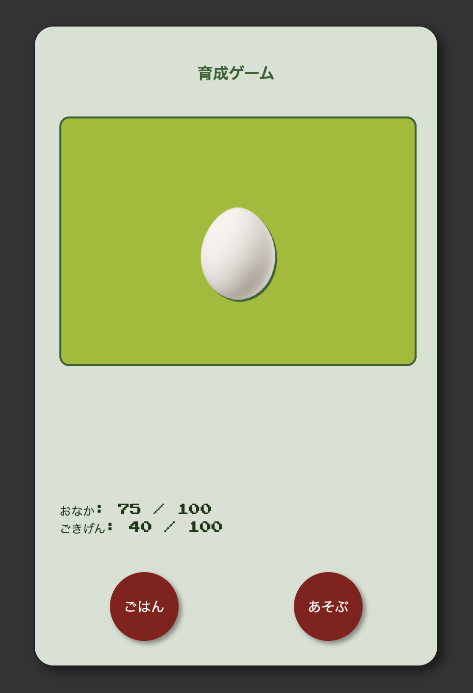

# CursorRulesで作るレトロ育成ゲーム

[](https://forthebadge.com)

`rules.js` という設定ファイルを書き換えるだけで、オリジナルの育成ゲームが作れる、絵文字ベースのシンプルなゲームエンジンです。

このプロジェクトは、**AIコーディングアシスタント（[Cursor](https://cursor.sh/)など）がゼロから構築できる**ように、`.cursorrules`ファイルに全手順が記述されているのが最大の特徴です。



## ✨ 主な特徴

*   **簡単カスタマイズ**: プログラミング不要で、キャラクター、進化、お世話の内容を自由に変更できます。
*   **サーバー不要**: `index.html`をブラウザで開くだけで、すぐに遊べます。
*   **絵文字ベース**: 画像ファイルの準備は不要です。好きな絵文字でキャラクターを表現できます。
*   **AIによる再現性**: `.cursorrules` を使えば、AIアシスタントがこのプロジェクトをいつでもゼロから再現できます。

## 🚀 遊び方

1.  このプロジェクトのファイルをダウンロードします。
2.  `index.html` ファイルを、お使いのWebブラウザで開きます。

これだけでゲームが起動します。

## 🎨 ゲームの改造方法

このゲームのすべてのルールは **`rules.js`** ファイルで管理されています。
このファイルの中にある `gameRulesYAML` という変数の内容（バッククォート `` ` `` で囲まれた部分）を、YAMLの記法に従って編集するだけで、あなただけのゲームが作れます。

### 主な編集箇所
*   **`characters`**: キャラクターの絵文字、名前、進化の条件などを変更できます。
*   **`parameters`**: 「おなか」や「ごきげん」の減る速さや最大値を調整できます。
*   **`actions`**: お世話ボタンの名前や、押したときの効果（回復量やセリフ）を変更できます。

## 🤖 AIでゼロから構築する方法

このリポジトリには `.cursorrules` という、AIへの指示書ファイルが含まれています。
これを使えば、AIコーディングアシスタントが、このゲームをファイル作成から段階的に自動で構築する様子を見ることができます。

1.  [Cursor](https://cursor.sh/) などのAI対応エディタで、空のフォルダを開きます。
2.  `.cursorrules` ファイルをそのフォルダにコピーします。
3.  AIアシスタントに、`.cursorrules` のステップを1から順番に実行するように指示します。

AIが自動でファイルを作成し、コードを書き、最終的にゲームを完成させます。

## 📁 プロジェクトの構造
```
.
├── index.html       # ゲームのメイン画面
├── style.css        # レトロ風デザインのスタイルシート
├── engine.js        # ゲームのロジックを担うエンジン
├── rules.js         # ゲームの全ルールを定義するファイル
├── README.md        # あなたが今読んでいるファイル
└── .cursorrules     # (任意) AIアシスタントのための構築指示書
``` 